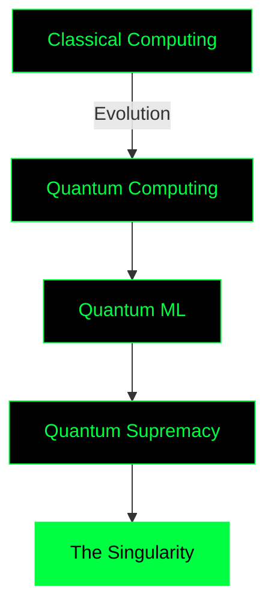

# <div align="center"></div>

<div align="center">
  
```ascii
╔═══════════════════════════════════════════════════════════════════════════════╗
║                                                                               ║
║  ██╗██████╗ ██████╗  █████╗ ██╗  ██╗██╗███╗   ███╗ █████╗                  ║
║  ██║██╔══██╗██╔══██╗██╔══██╗██║  ██║██║████╗ ████║██╔══██╗                 ║
║  ██║██████╔╝██████╔╝███████║███████║██║██╔████╔██║███████║                 ║
║  ██║██╔══██╗██╔══██╗██╔══██║██╔══██║██║██║╚██╔╝██║██╔══██║                 ║
║  ██║██████╔╝██║  ██║██║  ██║██║  ██║██║██║ ╚═╝ ██║██║  ██║                 ║
║  ╚═╝╚═════╝ ╚═╝  ╚═╝╚═╝  ╚═╝╚═╝  ╚═╝╚═╝╚═╝     ╚═╝╚═╝  ╚═╝                 ║
║                                                                               ║
║                     ███████╗ █████╗ ███╗   ██╗███████╗                      ║
║                     ██╔════╝██╔══██╗████╗  ██║██╔════╝                      ║
║                     ███████╗███████║██╔██╗ ██║█████╗                        ║
║                     ╚════██║██╔══██║██║╚██╗██║██╔══╝                        ║
║                     ███████║██║  ██║██║ ╚████║███████╗                      ║
║                     ╚══════╝╚═╝  ╚═╝╚═╝  ╚═══╝╚══════╝                      ║
║                                                                               ║
╚═══════════════════════════════════════════════════════════════════════════════╝
```

<!-- Matrix Digital Rain Banner -->


<!-- Alternative avec animation Matrix -->


[](https://ibrahimasane.vercel.app/)
[](https://github.com/Tamact)
[](https://github.com/Tamact)

</div>

---

<div align="center">
  
### 🟢 SYSTEM STATUS: `CONNECTED`

<!-- Matrix System Monitor -->

  
```javascript
const developer = {
    name: "Ibrahima Sory Sané",
    location: "Sénégal",
    status: "Building the Matrix",
    currentMission: "Quantum Computing & AI Integration",
    philosophy: "There is no spoon 🥄"
};
```

<!-- Matrix Code Animation -->


</div>

---

##  NEURAL INTERFACE

<table>
<tr>
<td width="50%">

### 🧬 CORE MATRIX

```python
class MatrixDeveloper:
    def __init__(self):
        self.name = "Ibrahima Sory Sané"
        self.role = "Full Stack Developer"
        self.knowledge = ["AI", "Quantum", "Web"]
        self.current_focus = "Quantum ML"
        
    def wake_up(self):
        return "Follow the white rabbit 🐇"
```

</td>
<td width="50%">

### ⚡ POWER LEVELS


</td>
</tr>
</table>

---

## 💊 CHOOSE YOUR PILL

<div align="center">
<table>
<tr>
<td align="center" width="33%">

### 🔴 RED PILL
**Deep Learning & AI**


</td>
<td align="center" width="33%">

### 🔵 BLUE PILL
**Web Development**


</td>
<td align="center" width="33%">

### ⚛️ QUANTUM PILL
**Next Level**


</td>
</tr>
</table>
</div>

---

## 🎯 MISSION PROTOCOLS

<details>
<summary><b>🧠 PROJECT: UJUZAI</b> </summary>

```yaml
Project: UjuzAI
Type: AI-Powered Recruitment System
Status: OPERATIONAL
Tech_Stack:
  - Frontend: React with Matrix UI
  - Backend: FastAPI
  - AI: Transformers, Qdrant
  - Database: PostgreSQL
Features:
  - CV Screening with AI
  - Semantic Search
  - Automated Ranking
```
</details>

<details>
<summary><b>♻️ PROJECT: ECOPRIME</b> </summary>

```yaml
Project: Ecoprime
Type: Eco-Responsible Platform
Status: ACTIVE
Tech_Stack:
  - Mobile: Flutter
  - Backend: Node.js
  - Blockchain: Smart Contracts
  - Database: PostgreSQL
Features:
  - Recycling Rewards System
  - Blockchain Transactions
  - Green Score Tracking
```
</details>

<details>
<summary><b>🔐 PROJECT: AUTHCHAINLIB</b> </summary>

```yaml
Project: AuthChainLib
Type: Decentralized Auth Library
Status: IN_DEVELOPMENT
Tech_Stack:
  - Core: Flutter/Dart
  - Security: Blockchain
  - Auth: Mnemonic Seeds
Progress: ████████░░ 80%
```
</details>

---

## ⚡ SYSTEM METRICS

<div align="center">

<!-- Matrix Animation Header -->

  


<!-- Matrix Activity Graph -->


<!-- Trophies Matrix Style -->


</div>

---

## 🌐 NETWORK CONNECTIONS

<div align="center">

[](https://www.linkedin.com/in/ibrahima-sory-sane)
[](mailto:ibrahimasorysane986@gmail.com)
[](https://ibrahimasane.vercel.app/)
[](https://github.com/Tamact)

</div>

---

## 🧬 QUANTUM EXPERIMENTS

<div align="center">



### 🔬 Current Research
- **Quantum XOR Classifier** - `Status: Testing`
- **Variational Quantum Circuits** - `Status: Learning`
- **Quantum Clustering Algorithms** - `Status: Implementing`

</div>

---

## 📡 TRANSMISSION LOG

<div align="center">

<!-- Matrix Style Analytics -->


<br/>

<!-- Animated Visitor Badge Matrix Style -->


<!-- Alternative Matrix Counter -->


```css
@keyframes matrix-rain {
    0% { transform: translateY(-100%); opacity: 0; }
    10% { opacity: 1; }
    90% { opacity: 1; }
    100% { transform: translateY(100%); opacity: 0; }
}

.reality { 
    status: "There is no spoon";
    perspective: "Infinite";
}
```

<!-- Matrix Grid Animation -->


</div>

---

<div align="center">

### 💭 SYSTEM MESSAGE

```
> "The Matrix has you..."
> "Follow the white rabbit."
> "Knock, knock, Neo."
```


**"Free your mind"**

---


</div>
