  

  <h1>Salut, je suis Ibrahima Sory Sané 👋</h1>
  

    <b>Développeur Fullstack | Passionné d'IA | Explorateur Quantique ⚛️</b> 
    Je conçois des systèmes intelligents à l'intersection des données, du web et de la science.
  

  
  

    
    
    
  

---

<table width="100%">
  <tr>
    <td width="65%" valign="top">
      <h3>👨‍💻 À propos de moi</h3>
      <ul>
        <li>🌍 Basé au <b>Sénégal</b>.</li>
        <li>🧠 Actuellement en pleine exploration de la <b>programmation quantique</b> et de l'<b>IA multimodale</b>.</li>
        <li>💡 J'aime résoudre des problèmes concrets avec du code propre, performant et scalable.</li>
        <li>🎯 Mon side-project créatif : <b>IBRAHIMA – Creative Digital & Branding</b> <i>(Bientôt disponible)</i>.</li>
      </ul>
    </td>
    <td width="35%" valign="top">
      <h3>🧰 Compétences</h3>
      

        
        
        
        
        
        
        
        
        
      

    </td>
  </tr>
</table>

---

### 🚀 Projets en vedette

<table>
  <tr valign="top">
    <td width="50%">
      <b>🧠 UjuzAI</b>
      <blockquote>Outil de recrutement basé sur l'IA pour le screening de CV.</blockquote>
      
<b>Tech :</b> React · Qdrant · PostgreSQL · Transformers, FastAPI

    </td>
    <td width="50%">
      <b>♻️ Ecoprime</b>
      <blockquote>Plateforme éco-responsable de recyclage avec système de récompenses.</blockquote>
      
<b>Tech :</b> Flutter · Node.js · PostgreSQL · Blockchain

    </td>
  </tr>
  <tr valign="top">
    <td width="50%">
      <b>🔐 AuthChainLib</b> <small>(En cours de développement)</small>
      <blockquote>Librairie d'authentification décentralisée pour Flutter utilisant la blockchain & les mnémoniques.</blockquote>
    </td>
    <td width="50%">&nbsp;</td>
  </tr>
</table>

---

### ⚛️ Mon Exploration Quantique

- 🔭 **Apprentissage** :
  - ✅ Fondamentaux de Qiskit
  - ✅ PennyLane pour le Quantum Machine Learning
  - ⏳ Circuits Quantiques Variationnels (Cirq)

- 🧪 **Expérimentations** :
  - Classifieur XOR quantique
  - Clustering assisté par algorithmes quantiques

----

### 📊 Mes Statistiques GitHub

  
  

  

---

  

  <b>“Construire avec passion. Résoudre avec ambition. Explorer sans limites.”</b>

