<!-- Banner -->

  

<h1 align="center">Hi, I'm Ibrahima Sory Sané 👋</h1>

  <b>Fullstack Developer | AI Enthusiast | Quantum Explorer ⚛️</b> 
  Building intelligent systems at the intersection of data, web, and science.

---

## 🧰 Tech Stack & Tools

  
  
  
  
  
  
  
  
  

---

## 🧠 Featured Projects

### 🧠 UjuzAI  
> AI-powered recruitment tool for CV screening  
Tech: React · Qdrant · PostgreSQL · Transformers, FastAPI

### ♻️ Ecoprime  
> Eco-responsible recycling platform with reward system  
Tech: Flutter · Node.js · PostgreSQL · Blockchain

### 🔐 AuthChainLib *(WIP)*  
> Decentralized authentication library for Flutter using blockchain & mnemonics

---

## ⚛️ Quantum Exploration

- 🔭 **Learning**:
  - [x] Qiskit Fundamentals
  - [x] PennyLane for QML
  - [ ] Variational Quantum Circuits (Cirq WIP)
- 🧪 **Experiments**:
  - Quantum XOR classifier
  - Quantum-enhanced clustering

---

## 📈 GitHub Stats

  
  

## 💡 A Bit More About Me

- 🌍 Based in Senegal  
- 📚 Currently exploring Quantum Programming & Multimodal AI  
- 🧠 I love solving real-world problems with clean, scalable code  
- 🎯 Side-brand: [IBRAHIMA – Creative Digital & Branding](load...)

---

## 📫 Let’s Connect

- 🌐 Website: (https://ibrahimasane.vercel.app/)
- 💼 LinkedIn: [linkedin.com/in/ibrahimasorysane](https://www.linkedin.com/in/ibrahima-sory-sane?utm_source=share&utm_campaign=share_via&utm_content=profile&utm_medium=android_app )  
- 📧 Email: ibrahimasorysane986@gmail.com

  

---

  

<b>“Build with passion. Solve with purpose. Explore beyond limits.”</b>

